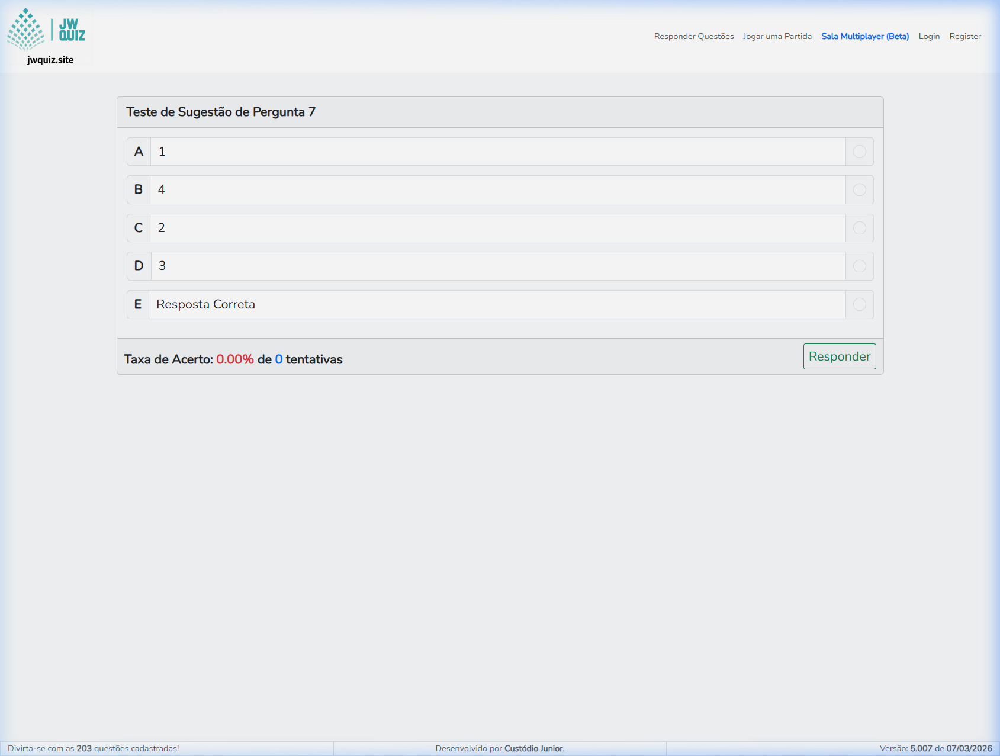
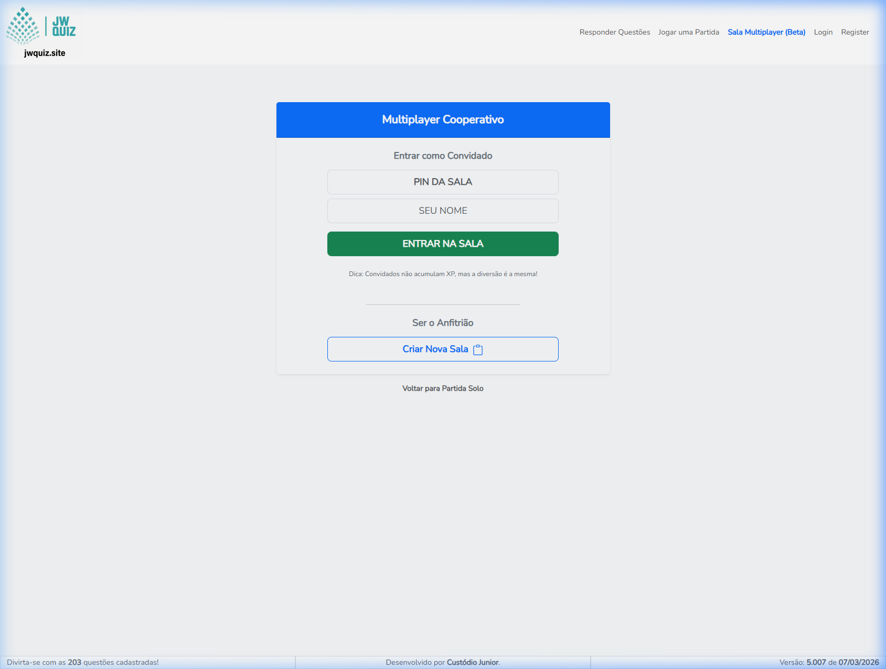
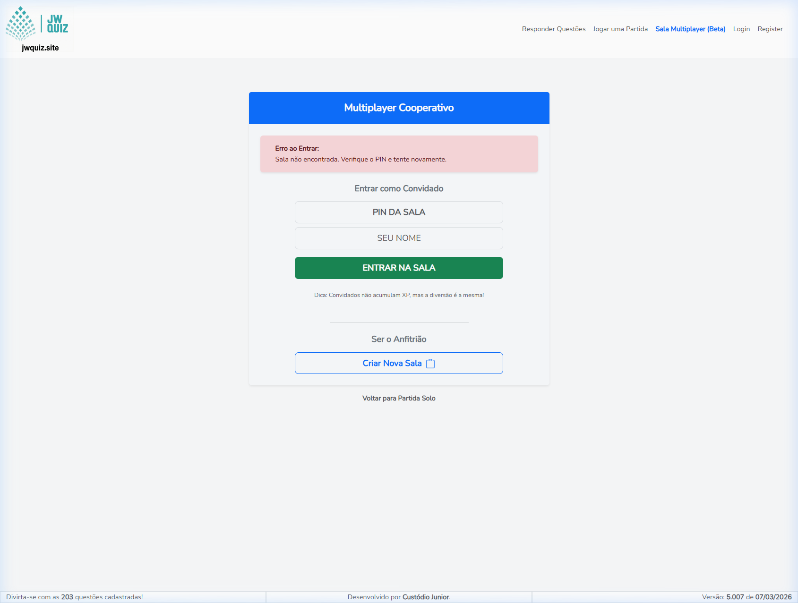
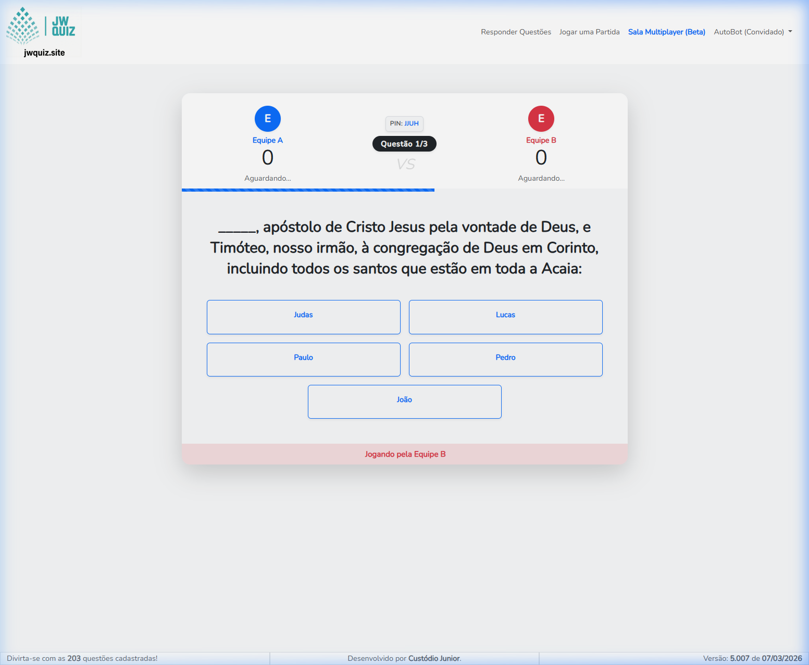
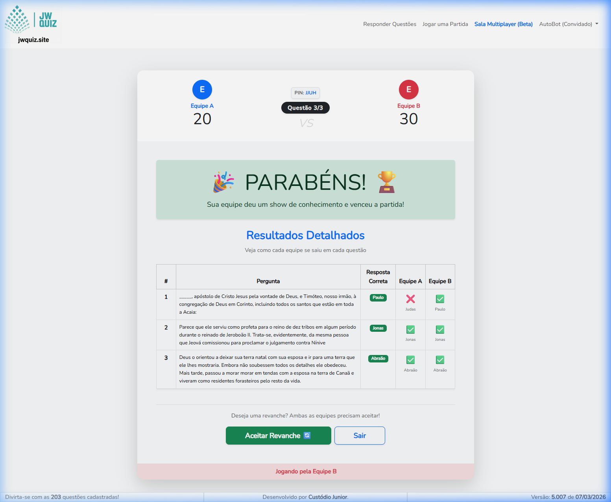

# JW Quiz - Multiplayer Cooperativo 🏆

Aplicação web premium de quiz desenvolvida com **Laravel + Vue + WebSockets (Ratchet)**.

A plataforma evoluiu e agora oferece uma experiência de **Multiplayer Cooperativo** em tempo real, onde as equipes competem entre si votando simultaneamente, além de manter os tradicionais modos solo com login para estatísticas.



## 🌟 Novidades da Versão Multiplayer

- **WebSockets em Tempo Real:** Sincronização ultrarrápida de votos, ranking de equipes e cronômetro através da porta `8090`.
- **Lobby Cooperativo:** Anfitriões criam salas dinâmicas e convidam amigos usando um **PIN** de 4 dígitos.
- **Dedo Mais Rápido (Mecânica de Desempate):** Agora a maioria da equipe decide a resposta. Se houver empate na equipe, o jogador que clicou milissegundos primeiro ganha o voto!
- **Morte Súbita:** Em caso de empate entre a *Equipe A* e a *Equipe B* no placar geral, uma série de "Morte Súbita" com 5 opções entrará em cena automaticamente!
- **Acesso de Convidados:** Facilidade para amigos jogarem instantaneamente, usando o celular apenas com um Apelido temporário.



> **Feedback Interativo:** O sistema avisa elegantemente se um jogador tentar entrar em uma partida que já acabou.
> 
> 

---

## 📸 Gameplay em Ação

Durante a partida, cada segundo conta. Veja como a interface unificada centraliza a disputa!

**Tela de Jogo (Ao Vivo):**


**Placar Final Resumido:**


---

## 🛠 Tecnologias

- **Backend:** PHP 8.2+ (Laravel 12) + WebSockets (Ratchet `cboden/ratchet`)
- **Frontend:** HTML5, Alpine.js/Vue 3, Bootstrap 5 e CSS Vanilla Premium
- **Database:** MySQL
- **Assets:** Vite 6

## 🚀 Requisitos e Instalação

1. Clone o repositório e acesse a pasta do projeto.
2. Instale as dependências:
```bash
composer install
npm install
```
3. Configure o `.env` copiando do `.env.example`:
```bash
cp .env.example .env
php artisan key:generate
```
4. Configure o acesso ao banco em `.env` e rode as migrations:
```bash
php artisan migrate
```

## ▶️ Como Rodar a Aplicação

Para o funcionamento completo da plataforma, você precisa iniciar **2 terminais** essenciais:

Terminal 1 (Servidor Web Laravel):
```bash
php artisan serve --host=0.0.0.0 --port=8080
```

Terminal 2 (Servidor WebSockets do Multiplayer):
```bash
php artisan websocket:serve --port=8090
```

*Nota: Se você for desenvolver no frontend ativamente, abra um 3º terminal rodando `npm run dev`.*

Acesse na sua rede: `http://localhost:8080` (ou usando o IP local do PC, como `http://192.168.0.x:8080`).

---

## 🎮 Modos de Jogo Disponíveis

### 1) Partida Cooperativa (Beta)
- Rota: `GET /lobby`
- Luta de Equipes: Reúna os amigos na Equipe A e Equipe B. Use a tela principal como "TV" e conectem os smartphones via QR ou PIN.

### 2) Partida Autenticada Clássica (20 Questões)
- Rota: `GET /partida`
- Desafio solo e progressão de XP para jogadores fixos e logados.

### 3) Jogada Contínua e Rápida
- Rota: `GET /`
- Respostas rápidas e anônimas para treino.

## 👥 Áreas Administrativas
- **Jogador:** Explorar o quiz e acumular XP nas partidas solo.
- **Supervisor:** Aceitar ou descartar sugestões da comunidade.
- **Administrador:** Gerenciamento total de questões, logs e usuários base.
